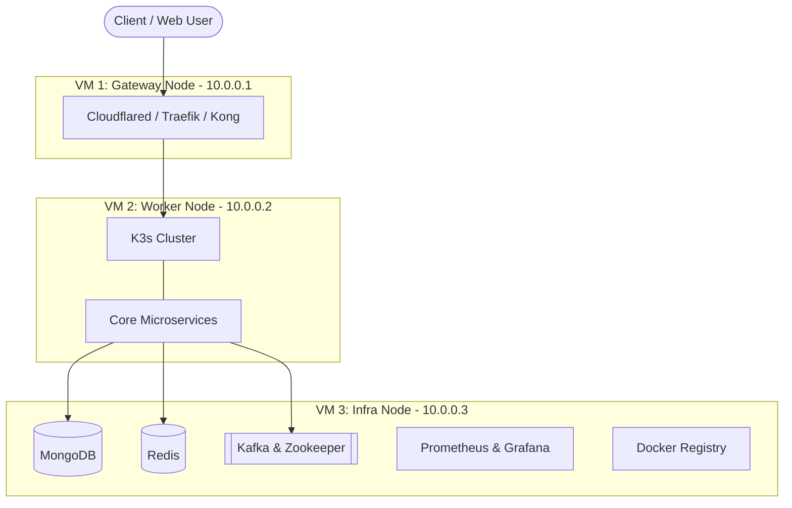
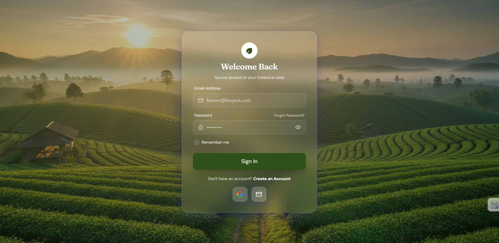
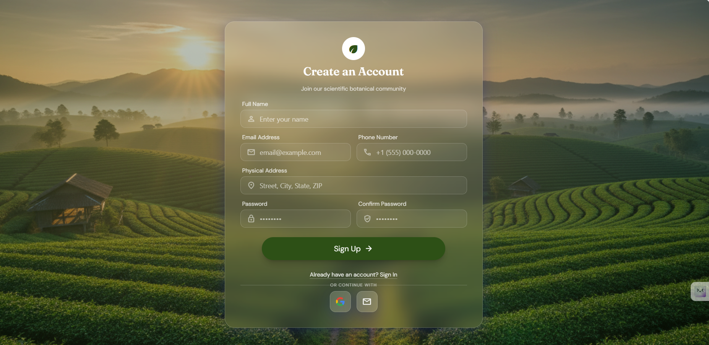
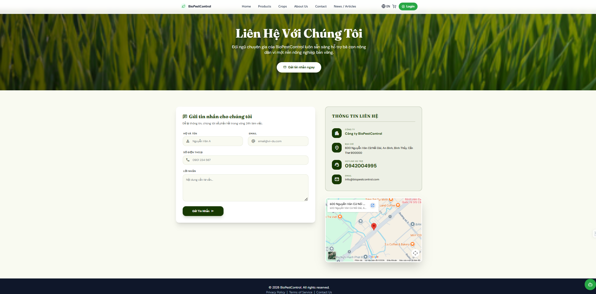
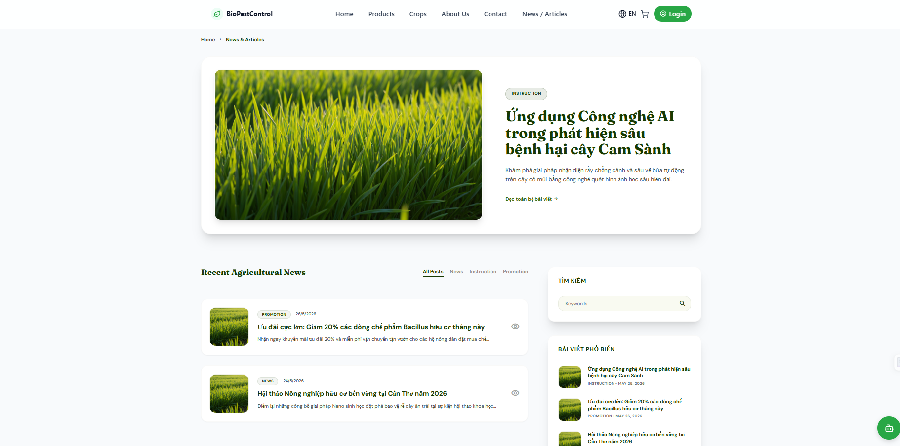

# Bio Pest Control System

BioPestControl is a high-performance, e-commerce platform specifically designed for stores trading in biological plant protection products (pesticides, organic fertilizers, etc.) in Vietnam. 
It aims to digitalize traditional business models, manage specialized product categories, and streamline complex operational processes to provide a greener and safer future for agriculture.

## 👥 User Roles & Features

The system implements strict Role-Based Access Control (RBAC) with four main roles:

### 1. Guest
Visitors who have not logged in can:
- **Browse & Search:** View product lists, filter by category/price, and search for specific items.
- **Community:** Read product feedback and comments.
- **News:** View agricultural news and articles.

### 2. Customer
Registered users can access a comprehensive shopping experience:
- **Shopping Cart & Checkout:** Manage cart items and proceed to checkout using multiple payment methods (COD or online via PayOS).
- **Order Management:** Track order history and delivery status.
- **Agricultural Support Tools:** Access specialized tools like the Drug Dosage Calculator and Chemical Mixability Checker.
- **Feedback:** Submit reviews and rate products.

### 3. Staff
Operational staff responsible for daily tasks:
- **Product & Inventory:** Update product info and manage warehouse imports/exports.
- **Order Processing:** Monitor and update customer order statuses.
- **Customer Interaction:** Reply to, edit, or moderate customer feedback.
- **Content:** Manage news and agricultural articles.

### 4. Admin
System administrators with full access to reporting and management:
- **Business Dashboard:** View real-time statistics on revenue, orders sold, and best-selling products.
- **Catalog & Discounts:** Manage product categories, promotional discounts, and chemical safety information.
- **Staff Management:** Create and manage staff accounts and permissions.
- **Inventory Oversight:** Oversee warehouse imports and exports.

## 🏗 System Architecture

The platform is built on a scalable microservices architecture utilizing modern technologies (ASP.NET Core, SQL Server, MongoDB, Kafka, etc.):
- **Identity Service:** Authentication, JWT token issuance, and RBAC management.
- **Catalog Service:** Product catalog and master data.
- **Inventory Service:** Warehouse operations and stock levels.
- **Ordering Service:** Order lifecycle and checkout workflows.
- **Payment Service:** Third-party gateway integrations (PayOS, VNPay).
- **Agri Expert Service:** Agricultural data, dosage calculations, and chemical mixability checking.
- **Trading Service:** Specialized trading transactions and exchanges.
- **Article Service:** Content Management System (CMS) for news and agricultural guidelines.

## 🚀 Infrastructure & Deployment

The system is containerized and deployed across a cluster of 3 Virtual Machines (VMs) to ensure high availability, distributed processing, and seamless traffic routing:

### VM 1: Gateway (10.0.0.1)
Acts as the entry point and ingress controller for external traffic.
- **Traefik & Kong Gateway:** API gateways and load balancers directing traffic to respective microservices.
- **Cloudflared Tunnel:** Secure tunneling for external access.

### VM 2: Worker Node (10.0.0.2)
The primary computational node running the Kubernetes (K3s) environment.
- Hosts the core microservices (Identity, Catalog, Ordering, etc.).
- Serves as the K3s control-plane and worker node.

### VM 3: Infrastructure (10.0.0.3)
Centralizes all stateful services, messaging queues, and system monitoring tools.
- **Message Broker:** Kafka & Zookeeper for asynchronous event-driven communication.
- **Databases & Cache:** MongoDB (for unstructured data) and Redis.
- **Monitoring & Logging:** Prometheus and Grafana for real-time system metrics and dashboards.
- **Registry:** Local Docker Registry for storing container images.

## 🖼 UI Screenshots

Here are some screenshots of the application directly from the documentation:

## 📖 Quick User Guide

### For Customers
1. **Registration:** Click `Login -> Create an Account`. Enter your details or register using Google.
2. **Shopping:** Browse products on the `Products` page. Click `Add to Cart` on your desired items.
3. **Checkout:** Go to your Cart, click `Proceed to Checkout`, enter shipping info, choose payment (COD/PayOS), and place the order.
4. **Agri Support:** Use the `Agricultural Calculator` to compute dosages and `Checker Mixability` before mixing chemicals.

### For Staff/Admin
1. Navigate to the specialized administration interface (Blazor/Razor Pages).
2. Use the left sidebar to manage `Customers`, `Orders`, `Warehouse`, and `Products`.
3. (Admin) Access the `Revenue Dashboard` to monitor overall business performance.

---
*Developed by Group 4 - FPT University*
